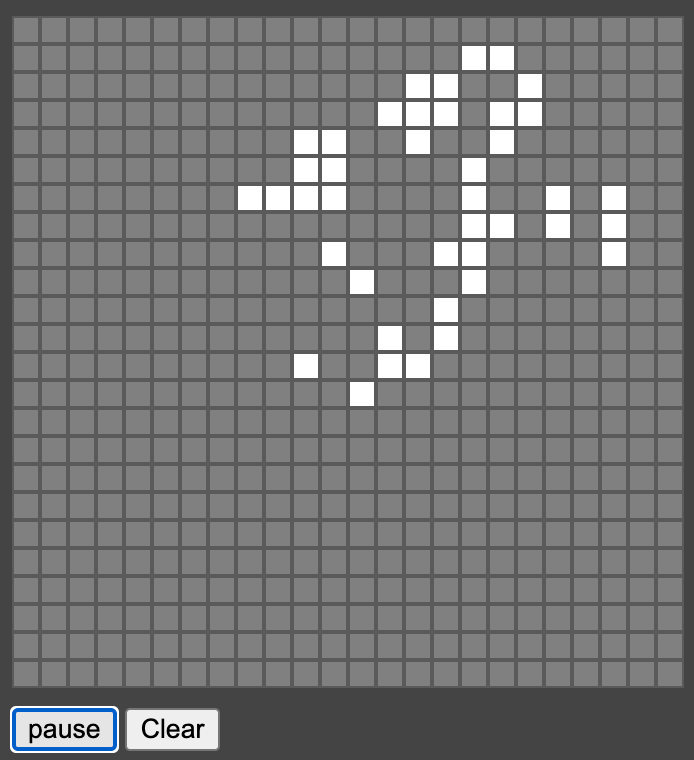

# Conway's Game of life (made with Vanilla JS)

Look for [demo]()

# 📄 Description

A basic version of the Game of Life model by John Horton Conway

## ℹ️ Overview

- The current version offers the creation of cells and the launch of the game with a pause button.

## 🚀 Usage instructions

Nothing to install, just load index.html

## 💭 Feedback and contribution

> *If you found this project nice or if you have suggestions, please start a **Contribution** !*

### ✍️ Author

I am [Maxime Macé](https://github.com/MaximeMace), French computer engineer. I designed this game to practice on the PhaserJS library in a fun and playful way.

## 📖 Find me on

[LinkedIn](https://www.linkedin.com/in/maxime-mace-09694515b/)
